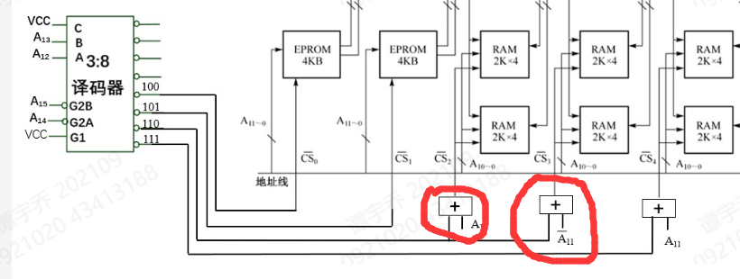
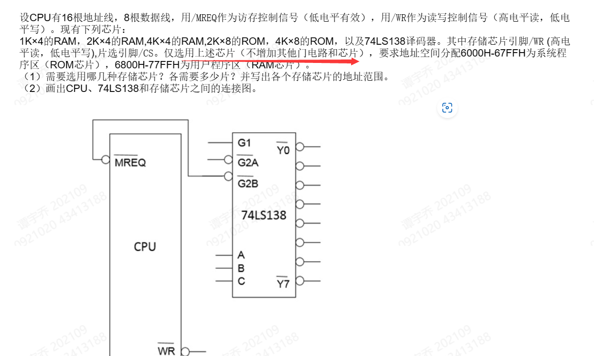

# ***《计算机组成原理与结构》重要知识点***

**期末题型**

一、简述题（30分）6题*5分=30
二、分析题（24分）
三、设计题（28分）
 四、编程题（18分

# **常见问题**

* **什么是总线**？

> 一组能为多个部件分时共享的公共的信息传送线

* 总线周期

> CPU完成一个访存或访问IO端口所需时间

* 硬件中断

> 由某个硬件中断请求信号印发的中断

* 比较CPU内总线和系统总线在互连对象、信号组成、时序控制等方面的不同之处

>  CPU内总线：连接CPU内部的寄存器、运算部件，通常为单组信号线，采用同步控制
>
> 系统总线：连接计算机系统各个功能部件，包含数据、地址、控制三种信号，同步、异步、扩展同步控制

* 试举两例说明同步控制方式在实际应用中的变化

> 1. 总线周期允许插入延长周期
> 2. 同步方式中引入异步应答

* 在系统总线中，什么情况下适合使用同步控制方式？什么情况下适宜使用异步控制方式？

> 总线上挂接的部件速度差异不大、传送距离近、传送时间确定的情况下适宜用同步控制方式。反之使用异步控制方式。

---

* 高速Cache用来存放什么内容？设置它的主要目的是？

> 主要存放当前活跃的数据或程序
>
> 目的：CPU和主存的速度匹配

* **什么是随机存储方式**？**什么是直接存储方式？什么是顺序存储方式？**

> 随机：可根据地址访问任一存储空间，访问时间与地址无关
>
> 直接：读写部件先指向一块区域，在区域中顺序查找，访问时间与地址有关
>
> 顺序：顺序查找存储空间，访问时间与地址有关

* 访问堆栈能否使用随机存取方式？为什么？

> 每次只能访问栈顶单元，不能访问任一单元

* 动态存储器存储信息的原理与静态有何不同？集中、分散、异步三种刷新方式如何安排周期？

> 动态利用电容电荷存储信息，静态利用稳态触发器存储信息。
>
> 集中刷新：在2ms内集中安排所有刷新周期
>
> 分散刷新：各刷新周期分散在存储周期中
>
> 异步刷新：刷新周期分散安排在2ms内

---

* **单级/多级中断方式下的中断服务程序处理流程**

> **单级中断**：保护现场、中断服务程序处理、恢复现场、开中断、返回
>
> **多级中断：**保护现场、开中断送新屏蔽字、中断服务程序处理、关中断、恢复现场和屏蔽字、开中断、返回

* **描述从接口提出中断请求到转入中断服务程序的过程**

> 接口提出中断请求、CPU响应批准请求、关中断、保存断点、保护现场、接口送出中断号，CPU将中断号转换为中断地址查向量表，取出中断服务程序入口地址，转入中断服务程序

* **试比较中断处理和子程序调用的区别**

> * 子程序的调用是事先人为设置好的，中断处理具有随机性
> * 子程序执行受主程序控制，而中断服务程序与被中断程序无关
> * 一段程序中最多调用一次子程序，而中断处理同时可能有多个中断请求

*  **什么是中断方式？**

> CPU暂停执行现行程序，转而执行中断服务程序以处理随机时间，并在执行完成后返回原程序继续执行。

* 与转子比较，中断方式的主要特点是什么？试举两例说明

> 中断方式调用程序是随机的。如键盘、打印机中断

* 中断和DMA方式有何异同点？各应用于什么场合？

> DMA方式仅占用系统总线，不用切换程序，因而不存在保存断点、和现场的保护也不用恢复。
>
> 中断适合中、低速外存，DMA适合高速外存

* **在DMA方式的初始化阶段，CPU通过程序分别向DMA控制器和IO接口传送了哪些初始化信息？**为什么要给这些初始化信息？

> * 给DMA控制器传输：数据传输方向、数据传输量、主存缓存首址
> * 给IO接口传输：外设寻址信息
>
> 因为将初始化信息传给DMA控制器后，CPU不再干预，由DMA控制器控制传送。

* DMA操作包含哪三个阶段？每个阶段分别完成哪些操作？

> 初始化阶段：CPU用程序传送初始化信息
>
> 传送阶段：DMA控制器掌控总线权，控制传送
>
> 善后处理阶段：CPU执行中断操作作结束处理

* **在程序执行过程中，CPU合适响应中断请求？合适响应DMA请求？**

> 中断请求在一条指令执行完后响应。因为中断程序本质上是程序切换过程，不能影响程序的完整性
>
> DMA请求在一次总线周期之后响应。因为DMA不是程序切换，在一条数据传送后可响应

---

* **简述微程序控制方式的基本思想**

> 答案看到两种
>
> * 一条微指令对应一步操作所需要的微命令；一段微程序对应若干微指令，解释执行一条机器指令；微程序存储在控制存储器中
> * 将CPU工作流程对应的每个微操作命令系列编写称微程序，所有微程序存放在一个只读存储器-控制存储器中。控制器自动按照微程序的逻辑顺序，逐条取出微指令并执行，以实现CPU工作流程的控制。

* **组合逻辑控制器和微程序控制器在产生微命令的方式上有什么不同**？

> 组合逻辑控制器通过组合逻辑电路产生微命令
>
> 微程序控制器通过微程序控制产生微命令（考试可答得更详细）

* **什么是组合逻辑控制方式？什么是微程序控制方式？有哪些优缺点**

> 组合：通过综合化简产生微命令的条件，形成逻辑式，利用组合逻辑电路产生微命令。
>
> 优点：速度快 缺点：设计不规整，不易拓展程序
>
> 微程序控制方式：用微指令产生微命令的方式/设计CPU时，根据指令系统事先编制微程序，存入控制存储器（用程序设计思想产生微命令序列）
>
> 优点:设计规整，易拓展程序 缺点：速度慢

# **第一章** ***概论***

一、基本概念

1. 冯•诺依曼体制？存储程序方式？

> **冯诺依曼体制**：
>
> 一、采用二进制来表示信息  二、采用存储程序的工作方式 三、计算机硬件系统由运算器、控制器、存储器、输入输出设备组成
>
> **存储程序方式：**
>
> 1. 编制程序
> 2. 存储程序
> 3. 自动、连续的执行程序

2. 控制流？数据流？

> 数据流——描述程序运行过程中数据的流转方式及其行为状态
>
> 控制流——控制程序逻辑执行的先后顺序，控制流实际上是数据流融入控制层之后形成的逻辑处理和程序跳转的结果。

1. 模拟信号？数字信号？数字信号有哪两种？

> **模拟信号：** **幅度**连续随着时间变化的信号
>
> **数字信号：**幅度不随时间变化，而是跳跃变化
>
> 包括，**电平信号、脉冲信号**

4. 总线及其组成？

> 地址总线、数据总线、控制总线

5. 接口的概念？

>*接口是指系统的(硬件或软件)组件和其他组件的交互点*

6. 基本字长？

> **机器字长（基本字长）：**参加一次**定点运算**的操作数的位数，通常与CPU寄存器或内部数据总线的位数有关。

7. CPU主频？时钟频率？

> 外部频率或基频，**也叫做系统时钟频率**
>
> CPU**主频** = 外频 * 倍频系数
>
> ### **1）CPU的主频**
>
> ​    **CPU主频是指CPU内核的工作频率，即CPU的时钟频率，计算机的操作在时钟信号的控制下分步执行，每个时钟信号周期完成一步操作，时钟频率的高低在很大程度上反映了CPU速度的快慢。**

8. 数据通路宽度？数据传输率？

> （1）数据通络宽度
>        数据通路宽度是指数据总线一次能并行传输的数据位数，它会直接影响计算机的性能。一般分为CPU内部和CPU外部两种情况。CPU的内部数据通路宽度一般与CPU的基本字节长相同，也等于CPU内部总线的位宽；CPU外部数据通路宽度则等于系统数据总线的位宽。
>
> （2）数据传输率（data transfer rate，DTR）
>        数据传输率也叫比特率，是指单位时间内信道的数据传输量，它基本单位是bps。

1. 主存容量

> 指可编制的存储单元个数（**取决于地址码位数**）×存储单元的位数（**表明编址单位**）

# **第二章** ***计算机中的信息表示***

一、基本概念

1. 一个数值型数据的完整表示需三个方面？

> * 数的组合规则--进位计数制
> * 小数点的位置确定 -- 数的定点表示和浮点表示
>   * 符号的选择 --带符号数的代码表示

2. 权、基数？

> **基数：在任一数制中，某一数位上可选用的数码个数**
>
> **权：每一数位所表示位置的值**

3. 真值？机器数的定义？分类？

> 真值：数据真实的值
>
> *机器数是将符号数字化的数，是数字在计算机中的二进制表示形式*
>
> **分类：原码补码反码**

4. 数的定点表示与浮点表示？

> 定点表示：分为定点整数、定点小数、不定点整数
>
> 浮点表示：IEEE754的标准，数符（S），阶码（E），尾数（M）

5. 指令？指令系统？

> 指令：**按某种规律有序排列的、能被CPU识别并执行的二进制代码**
>
> 指令系统：**一台计算机能执行的所有指令的集合**

6. 地址码？寻址方式？地址结构？

> **地址码包括指令中给出操作数或操作数的地址、存放运算结果的地址、下一条指令的地址**
>
> **将产生操作数有效地址的方式称为寻址方式**
>
> > 操作数可能存在于何处？
> >
> > * 指令直接给出或紧跟指令在下一个存储单元
> > * 寄存器中
> > * 主存的存储单元中
> > * 堆栈中，隐含约定由堆栈指针SP提供地址
> > * IO接口寄存器中
>
> **地址结构：**
>
> * **显地址**：在指令代码中明确给出了主存储器单元地址码或者寄存器号
> * **隐地址**：如果地址是以隐含的方式约定，则在指令中并不给出地址码

7. 寻址方式：

大致可将众多的寻址方式归纳为以下四大类，其它的寻址方式则是它们的变型或组合。

① 立即寻址。在读取指令时也就从指令之中获得了操作数，即操作数包含在指令中。

② 直接寻址类。直接给出主存地址或寄存器编号，从CPU内或主存单元内读取操作数。

③ 间接寻址类。先从某寄存器中或主存中读取地址，再按这个地址访问主存以读取操作数。

④ 变址类。指令给出的是形式地址（不是最终地址），经过某种变换（例如相加、相减、高低位地址拼接等），才获得有效地址，据此访问主存储器以读取操作数。

8. 何谓隐式I/O指令？其主要特点是什么？

> 采用统一编制，IO端口占用CPU提供的地址空间的一部分，比如CPU提供的全部地址空间的低地址部分用于主存单元、高地址部分分配给IO端口以示区分。
>
> 统一编制时，设备接口中的寄存器视为一个存储单元，采用通用的数据传送指令实现IO操作，又称为隐式IO
>
> **特点：地址码本身可区分存储单元地址和IO端口地址，无需其他操作，采用通用的数据传送指令即可**

9.主机调用外围设备，外设编址可采用那几种方式？

> 单独编址：为每个寄存器（IO端口）分配独立的端口地址，IO指令中给出端口地址，在处理器的指令集中，**需要有专门的IO指令来读写端口**
>
> 统一编址：IO端口占用CPU提供的地址空间的一部分，比如CPU提供的全部地址空间的低地址部分用于主存单元、高地址部分分配给IO端口以示区分。**地址码本身即可区分存储单元和IO端口**

**二、计算题**	

1.扩展操作码：根据条件计算指令条数？

> 留出扩展标记。见题目

2.根据寻址方式寻找操作数？

3.IEEE754短浮点数格式表示？

> 一位S（0为正数1为负数） 8位E （E采用e+127的移码表示）M（32位，实际为1.M)

 

# **第三章** ***中央处理器***

一、基本概念

1. CPU内部各寄存器的功能？

> * **通用寄存器组**：可编程访问的寄存器组，可以提供操作数、运算结果、地址指针、计数器等多种功能
>   * 模型机中：R0、R1、R2、R3
>   * 8086微机中：AX、BX、CX、DX、SP、BP、SI、DI
> * **程序计数器**：PC：用来只是指令在存储器中的存放位置
> * **程序状态字寄存器：PSW：**记录现行程序的运行状态和指示程序的工作方式
> * **堆栈指针：SP：**设置一个具有加减计数功能的寄存器作为堆栈指针，命名为SP，SP中的内容就是栈顶单元地址
> * **暂存器： C、D**不能被编程访问，只能CPU内部专用。目的是暂存某些中间过程产生的信息
>   * 模型机中需要从主存中读取源操作数地址或源操作数时，就使用暂存器C；读取目的操作数地址或目的操作数时使用D
> * **指令寄存器：IR：存放正在执行的指令**，它的输出包括操作码信息、地址码信息等，是产生微命令（控制信号）的主要逻辑依据。
> * **地址寄存器：MAR**：存放被访问单元的地址
> * **数据缓存寄存器：MDR：**存放**CPU与主存之间交换的数据。**无论是从主存读出的数据还是写入的数据都要经过MBR（MDR）

2. 数据通路结构？

> 1. 单组内总线、分立寄存器结构
> 2. 单组内总线、集成寄存器结构
> 3. 多组内总线结构
>
> * **CPU总线和数据通路结构：**ALU为内部数据传送通路的中心、寄存器采用分立结构、内总线采用单向数据总线，与系统总线的连接通过MAR、MDR实现

3.何谓同步控制方式，何谓异步控制？有何主要特征？应用场合？

> **同步控制：**同步控制方式就是指各项操作由统一的时序信号进行同步控制。意味着每个微操作必须在规定的时间内或固定时刻完成。
>
> * 特点：时钟周期时间固定；各步操作的衔接、各部件之间的数据传送受严格同步时钟定时控制。
> * 应用场合：用于CPU内部，设备内部、系统内部。
>
> **异步控制：**各项操作按不同需求安排时间，不受统一时序控制。
>
> * 特点：无统一时钟周期划分，各个操作间的衔接和部件之间的信息交换采用应答的方式
> * 应用场合：用于异步总线操作（各挂接部件速度差异大,传送时间不确定，传送距离远）。

4.何谓主从设备，试举例说明。

> 主设备：申请并掌握总线权的设备。
> 从设备： 相应主设备请求的设备。
> 操作流程:
> 主设备获得总线控制权
> 主设备询问从设备
> 从设备准备好–接收否则再次询问。
> 主设备发送/接收数据。
> 主设备释放总线控制权
> 优缺点：时间安排紧凑、合理；
>
> **DMA?**

5.同步控制中如何引入异步应答的，试举例说明.

> 扩展同步控制：即同步方式中引入了应答机制。
>
> **以固定时钟周期作为时序基础**，引入应答思想
> 例如： 8088最大模式，用一根总线请求/应答线实现总线权的转移。

7.判断下面叙述是否正确，说明理由：串行加法器中的进位链是串行进位链，并行加法器中的进位链只有并行进位链。

> 错，并行加法器中的进位链可以并行串行结合

12.1位全加器的结构及关系表达式。

> C~i~ = (ab) 与 (a异或b)C~i-1~
>
> 三个输入量一个输出量

13.并行加法器中的串行进位链结构：Cn = Gn + PnCn-1

并行进位链结构：Cn = Gn + PnGn-1+ … + Pn…P1C0

8.常用的加法器进位链结构有哪几种？

> 串行进位、并行进位

**8.影响加法器运算速度的主要因素：**

> 全加器的速度、进位传递速度（主要）

9.组合逻辑控制器、微程序控制器有何区别？

> 控制器：控制部件的主要功能是负责对指令进行译码，并且发出为完成每条指令所要执行的各种操作的控制信号（微命令）
>
> 组合逻辑控制方式：**综合化简产生微命令的方式，形成逻辑式**，由组合逻辑电路产生微命令；
>
> * 优缺点：产生微命令的速度较快、设计不规整，设计效率低、不易修改、扩展指令系统功能。
> * 应用场合：用于高速计算机，或小规模计算机
>
> 微程序控制方式 ：设计CPU时，根据指令系统事先编制好微程序，并存入控制存储器（CM

10.组合逻辑控制器、微程序控制器的时序系统是如何划分的？

> 组合逻辑控制器时序系统：采用三级时序系统：工作周期、时钟周期、工作脉冲
>
> * 工作周期：FT、ST、DT、ET、DMAT、IT
> * 时钟周期（节拍）：以访存时间作为一步操作时间
> * 工作脉冲：同步定时脉冲控制定时操作，每个时钟周期结束时设置一个脉冲

11.微命令、微操作、微指令、微指令周期、微程序？

> **微命令：各项操作所需要的控制命令**/**控制各功能部件的电平和脉冲信号**
>
> 一条机器指令的执行对应一段微程序
>
> 一段微程序可包含多条微指令
>
> 一条微指令包含机器指令一步所需要的微命令

6.微程序控制器思想的基本要点是什么？内部部件？

> 微程序控制的基本思想是:
>
> * 一条机器指令对应一段微程序
> * 一段微程序包含多条微指令
> * 一条微指令包含机器指令一步操作所需要的微命令
>
> 将CPU工作流程**对应的每个微操作命令序列编写成微程序(**微程序由若干微指令组成、每条微指令对应一个或几个微操作命令),**所有的微程序存放一个只读存储器中**;控制器自动按照**微程序的逻辑顺序,逐条取出微指令并执行,以实现CPU工作流程的控制**
>
> ---
>
> **内部部件**
>
> * 控制存储器（CM）：存放微程序（在CPU内部）
> * 微指令寄存器：μIR：存放现行微指令
>   * 微命令字段：提供机器指令一步操作所需要的微命令
>   * 顺序控制字段：指明微地址后续生成方式，用于控制微程序的连续执行
> * 微地址形成电路
>   * 形成依据：现行微指令地址、微程序转移地址、现行微指令顺序控制字段，决定形成方式、机器指令有关代码：操作码、寻址方式、机器运行状态
> * 微地址寄存器μAR：存放下一条微指令在CM中的地址
>
> 微程序执行过程：初始化μAR->CM->取机器指令微命令序列

14.时序信号？时序系统？

> 时序信号：计算机操作的时间标志
>
> 时序系统：即时序信号与操作的关系，用于规定各项操作所需的时间和时机

二、设计题：

CPU的逻辑组成及工作机制

> CPU的工作原理：
>
> CPU的工作过程就是从主存（缓存）中读取指令，将指令放入指令寄存器，然后对指令译码，把指令分解成一系列的微操作，在发出各种响应的控制命令，控制各功能部件执行相关的操作，从而完成一条指令的执行，实现对应的功能。

1.CPU的逻辑组成（模型机框图）

（1）CPU的逻辑组成→模型机框图；

（2）CPU内每个寄存器的作用；

（3）总线的分类及定义；

（4）控制器的分类及区别；

2.CPU的指令流程

（1）指令类型：MOV指令、双操作数算数逻辑运算指令、单操作数算是逻辑运算指令、转移/返回指令、转子指令；

（2）核心是寻址方式：立即寻址、R、(R)、—(R)、(R)+、@(R)+、X(R)；

> 模型机指令系统：定长指令格式16位，采用寄存器型寻址，即指令给出寄存器号

3.操作时间表的安排（微命令的安排）：

（1）CPU数据通路操作：按照数据的流向分成四段

ALU输入选择→AUL功能选择→移位器功能选择→分配脉冲（打入到寄存器中的脉冲）；

（2）与访问主存有关的微命令。

 

 

# **第四章** **存储子系统**

一、基本概念

1.主存、缓存、外存？

> 存储系统层次结构：典型结构：三级存储体系结构
>
> Cache:容量小、速度高
>
> 主存：容量较大、速度较高
>
> 外存：容量大、速度慢	

2.高速缓存Cache用来存放什么内容？设置它的主要目的是什么？

> (1)用来存放当前活跃的数据与程序,作为主存活跃区的副本;(2)设置它,是为了解决cpu与主存的速度匹配;

3.存储介质？

> 按存储介质，分为半导体存储器，磁表面存储器、光盘存储器

4.何谓随机存取？何谓顺序存取？何谓直接存取？请各试举一例。

> 随机访问存储器（RAM）：**随机存取**：可按地址访问存储器中的任一单元，**访问时间与地址单元位置无关**
>
> 如SRAM、DRAM
>
> **顺序访问存储器（SAM）：顺序访问时，读/写部件按照顺序查找目标地址，因此，访问时间与数据位置有关（如磁带）**
>
> **直接访问存储器（DAM）：访问时，读/写部件先直接指向一个小区域，再在该区域顺序查找，访问时间与数据位置有关（如磁盘、光盘）**

5.数据传输率

> 单位时间内存取的信息数量，也叫带宽
>
> 数据传输率 = 存储器数据位宽 / 存取周期bps

5.静态存储器SRAM、动态存储器DRAM存储原理？

> 静态存储器：**利用双稳态触发器存储信息**
>
> 动态存储器：**利用电容存储的电荷存储信息**

6.动态刷新分为哪几种情况，各有什么特点？

> 动态MOS存储单元：
>
> **四管单元**：保持原状态需要定期向电容补充电荷。**读出是非破坏性读出，读出过程即实现刷新**
>
> **单管单元：** **单管单元是破坏性读出，读出后需重写**
>
> `注意刷新和重写的区别：`
>
> 刷新：动态存储器，需要定期补充电容以保持原来信息
>
> 重写：破坏性读出后需要重写，以恢复原来的信息
>
> * 最大刷新间隔：大多数DRAM要求：保持2ms-64ms期间一定对所有单元刷新
> * 刷新方法：
>   * 单管动态存储器，读出时能自动重写补充电荷
>   * **各动态芯片可同时刷新，片内按行刷新**
> * 刷新周期（存取周期）：刷新一行需要的时间
> * 刷新周期数：刷新一片芯片所需的周期数由芯片矩阵的行数决定
> * 对主存的访问：
>   * CPU访存：由CPU提供行列地址随机访问
>   * 芯片刷新：由刷新地址计数器提供地址定时刷新
> * 刷新周期的安排方式：
>   * 集中刷新：2ms内集中安排所有刷新周期。用于实时要求不高的场合
>   * 分散刷新：各刷新周期分散安排在存取周期中。造成主存利用率降低，用在低速系统中
>   * 异步刷新：刷新周期分散安排在2ms内。

7.全地址译码方式？部分地址译码方式？

> **全译码方式：将除了与芯片连接的地址以外的所有高位地址用于译码产生片选信号**
>
> **部分译码方式：**将除了与芯片连接的地址外的部分高位地址用于译码产生片选信号（易出现地址重叠）

二、设计题：

半导体存储器逻辑设计：(地址分配、片选逻辑、逻辑框图)，片选逻辑采用全/部分译码方式。

 **易错点：**

> 1. 部分译码时，产生片选信号要用或门，且单个地址线的值取反
>
>    
>
> 2. 
>
>    不能增加门电路时，需要保持选用芯片的大小相同，即都为2K

 

# **第五章** **I/O系统**

一、基本概念

1. 总线是什么？有什么特点？

> **总线：一组为多个部件分时共享的信息传送线路**
>
> 特点：**分时共享：特定时刻只允许一个部件送出数据到总线上**
>
> **总线周期：完成一次主存或IO端口访问的时间**
>
> 总线分类
>
> * 按传输信号的类型
>   * 数据总线
>   * 地址总线
>   * 控制总线
> * 数据传送格式
>   * 并行总线
>   * 串行总线
> * 按时序控制方式
>   * 同步总线：由统一时序信号控制总线完成传送操作，在固定时钟周期内完成数据传送，由同步脉冲打入
>   * 异步总线：无固定时钟周期，以异步应答的形式控制传送
>   * 扩展同步总线：以时钟周期为基础，允许总线周期（完成一次主存或IO端口访问的时间）中时钟数可变【既有统一时序同步时钟，又有异步应答】
> * 按功能
>   * 内总线：CPU内部线
>   * 局部总线：主板各芯片之间互连的总线
>   * 系统总线：主板与插件板之间互连总线
>   * 外总线：计算机系统与外部设备之间互连的总线
> * 按方向分：
>   * 单向总线
>   * 双向总线

2. 总线的标准

> 针对系统总线和外总线
>
> * 物理特型
> * 功能特型
> * 电器特型
> * 时间特型
>
> **ISA、EISA、AGP、PCI、USB**

3. 接口

> 外设与系统总线之间的逻辑电路称为输入输出接口，IO接口
>
> **为什么需要IO接口**
>
> * 工作速度，不同速度外设与CPU连接
> * 数据格式的转换，外设与CPU的数据格式可能不同
> * 一次数据传送量的控制
> * 其他因素（如电平转换
>
> **IO接口的主要功能：**
>
> * 寻址：接受CPU送来的地址码、选择接口中的寄存器供CPU访问
> * 数据缓冲：实现主机和外设的速度匹配、缓冲深度与传送的数据量有关
> * 预处理：串-并格式转换，数据通路宽度转换，电平转换
> * 控制功能：传送控制命令与状态信息，实现IO传送控制

3. 系统总线上一般包含哪三组信息？

> 数据总线：传输数据信息，决定总线宽度
>
> 地址总线：传输地址信息，决定寻址能力
>
> 控制总线：传输控制信息和状态信息

4. 主机和外设的信息交换控制方式

> 直接程序传送：依靠CPU直接执行相关的IO程序来实现数据的输入和输出控制
>
> 中断方式：设备提出中断请求，主机响应后与设备交换信息，接口中包含中断控制请求
>
> DMA方式：支持**高速外设与主存之间进行DMA方式交换数据**

2. 中断方式定义、实质、特点？

> **中断含义**：CPU**暂时中止现行程序的执行**，转去执行为某个随机事件服务的中断处理程序。处理完毕后自动恢复原程序的执行。
>
> **实质：**
>
> * 程序切换
>   * 方法：**保存断点、保护现场、恢复现场、返回断点**
>   * 时间：**一条指令结束时切换，保证程序的完整性**
>
> **特点：**
>
> * 随机性
>   * 随机发生的事态（按键、故障）
>   * 有意调用，随即请求与处理的事态（调用打印机）
>   * 随机插入的事态(软中断指令可插入程序任何位置)

\3. 中断向量、中断向量表、向量地址？

> 中断类型码：每个中断源对应的编号
>
> 中断向量：中断服务程序入口地址
>
> 中断向量表：存放各中断服务程序的入口地址的单元
>
> 向量地址：访问中断向量表的地址码，可通过计算中断类型码得到
>
> **模型机中：向量地址=中断号+2**
>
> **IBM PC向量表：向量地址 = 中断号 * 4**

\4. 何谓向量中断？何谓非向量中断？各有何优点和缺点？

> 都是根据中断源获取服务程序入口
>
> **非向量中断：由软件查询提供服务程序入口地址**
>
> **向量中断：由硬件直接提供服务程序入口地址**

4. 中断响应响应条件

> 外设有请求且未被屏蔽
>
> CPU开中断
>
> 中断源优先级高于当前程序优先级
>
> 一条指令（非停机）结束后，即ET过后

\5. 单级中断、多重中断？ 

> 中断处理：主要任务：CPU执行中断服务程序
>
> 单级中断流程：
>
> * 保护现场、中断服务处理、恢复现场、开中断、返回
>
> 多级中断流程：
>
> * 保护现场
> * 送新屏蔽字、开中断（禁止同级别或更低级别的请求，开发更高级别的请求）
> * 中断服务处理
> * 关中断
> * 恢复现场及原屏蔽字
> * 开中断
> * 返回

\6. 程序直传方式定义、实质、特点？

> 依靠CPU直接执行相关的IO程序来实现数据的输入和输出的控制
>
> 优缺点：硬件开销小、并行程度低，实时性差

\6. DMA定义、实质、特点？

> 直接依靠硬件系统来控制主存和设备之间的数据传送，传送期间无需CPU干预，传送结束后通常通过中断方式通知CPU
>
> 特点：
>
> * 响应随机请求
> * 不影响CPU程序的执行，仅占用总线、无程序切换
> * 大批量数据的简单传送
>
> 典型的应用：
>
> * 主存和高速IO设备之间的简单数据传送
> * 大批量数据采集系统
> * 动态存储器DRAM的自动刷新
>
> DMA传送过程:
>
> * 程序准备：主程序实现初始化（对DMA控制器和接口
> * 传送请求
> * DMA传送：存储器--直传--IO（硬件实现）
> * 善后处理：执行中断处理程序

\7. 程序直传方式，中断方式，DMA方式之间的区别？

> 直接程序传送：依靠CPU直接执行相关的IO程序来实现数据的输入和输出控制
>
> 中断方式：设备提出中断请求，主机响应后与设备交换信息，接口中包含中断控制请求
>
> DMA方式：直接依靠硬件系统来控制主存和设备之间的数据传送，传送期间无需CPU干预，传送结束后通常通过中断方式通知CPU,支持**高速外设与主存之间进行DMA方式交换数据**

 

# ***《微型计算机原理与接口技术》重要知识点***

## ***第2章  微处理器与总线***

一、基本概念

6.8088/8086 CPU的特点？

> **指令流水线：8088/8085CPU并行完成程序的执行，假设不考虑存储器操作数**
>
> **内存分段管理：**
>
> * 8088/8086CPU的内部结构为16位【内部1M的存储单元，但寄存器只有16位】
> * 作为地址时，则只能访问64k存储单元
> * 采用分段管理的方法，将内存空间分为多个逻辑段，每个逻辑段最大64k存储单元，段内每个单元的相对地址码用16位表示
> * 每个段设置段地址用16位寄存器存储，以区分不同的逻辑段
>
> **支持多处理器系统：**
>
> * 8086 8088 具有最小与最大两种工作模式：
> * 最小模式，也称为单处理器模式，系统控制总线的信号由CPU直接产生
> * 最大模式，也称为多处理器模式，由总线控制器8288提供所有总线信号

7.8088/8086的差异

> * 外部数据总线宽度不同：
>   * 8088的外部宽度是8位，8086是16位
> * 访问存储器和IO控制的信号不同
>   * 8088 低电平访问内存
>   * 8086 高电平访问内存

1.微处理器主要由哪几部分构成？

2.说明8088CPU中EU和BIU的主要功能。在执行指令时，EU能直接访问存储器吗？

> CPU内部结构由两部分组成：执行单元（EU）、总线接口单元（BIU）
>
> **执行单元EU：包括ALU、8个通用寄存器、标志寄存器FLAGS和EU控制部件**
>
> **从指令队列不断取出指令代码，译码后产生执行指令的控制信号。**ALU完成算术和逻辑运算，通用寄存器存放操作数和运算结果，而运算结果的状态特征则保存到标志寄存器中
>
> **总线接口单元BIU：包括四个段寄存器、程序计数器、指令队列、地址加法器、总线控制逻辑**
>
> **负责CPU与存储器和IO接口之间的信息传送**。由于8086/8088CPU中的寄存器均为16位，而CPU外部地址线为20根，因此BIU中采用地址加法器得到20位的物理地址，可以寻址的存储单元为1M。

3.8086/8088CPU中，有哪些通用寄存器和专用寄存器？说明他们的作用。

> 内部由8个通用寄存器、4个段寄存器、2个控制寄存器
>
> * 通用寄存器包括
>   * 数据类寄存器：AX、BX、CX、DX，常用于存放操作数或运算结果
>   * 地址指针寄存器：包括堆栈指针寄存器SP和基址指针寄存器BP。处理可以存放操作数外，还可以作为地址指针，常用于在堆栈操作中存放偏移地址。
>     * SP：在堆栈操作中用来存放栈顶单元的偏移地址，永远指向堆栈的栈顶
>     * BP：默认用于存放当前堆栈内某个单元的偏移地址，即可以对堆栈内任意单元的数据进行操作。
>   * 变址寄存器：包括源变址寄存器SI和目的变址寄存器DI，处理可以存放操作数和作为地址指针外，还分别固定应用于数据的串操作指令中，提供串操作数的索引地址。
>     * SI：串操作指令中隐含作为源操作数偏移地址
>     * DI：串操作指令中隐含作为目的操作数的偏移地址
> * 段寄存器：
>   * CS，代码段寄存器
>     * DS：数据段寄存器
>   * ES：附加段寄存器
>   * SS：堆栈段寄存器
> * 控制寄存器：
>   * IP：指令指针寄存器，用以存放预取指令的偏移地址
>   * FLAGS：标志寄存器或程序状态字
>     * 算术或逻辑运算结果的特征位
>     * 控制标志位

4.8086/8088系统中，存储器为什么要分段？一个段最大为多少字节？最小为多少字节？

> 8086/8088的地址总线宽度为20位,其最大寻址空间是1 MB.
> 在16位字长的机器里怎么提供20位地址的问题,而解决的办法是采用存储器地址分段的方法.
> 程序员在编制程序时要把存储器划分成段,在每个段内地址空间是线性增长的.每个段的大小可达64 KB,这样段内地址可以用16位表示.
>
> 每段最长64KB，最短16B

5.8086/8088系统中，物理地址和逻辑地址是指什么？ 

> 物理地址：
>
> * 指每个内存单元在整个内存空间中具有的唯一的地址
> * 8086/8088CPU有20根地址线，它可以产生20位的地址码，寻址范围为2^20^.同时存储器按字节进行编制，索引存储器最大容量为1MB
>
> 逻辑地址：
>
> * *是指由程序产生的与段相关的偏移地址部分*

6.段地址，段基地址：

> 段地址：段寄存器中保存的16位地址
>
> 段基地址：段地址*16

二、计算题：

8086/8088系统中，物理地址和逻辑地址的转换？

> 段地址*16+偏移地址=物理地址

 

## **第3章** ***8086/8088指令系统***

一、基本概念

1.8086/8088指令系统的8种寻址方式

二、六大类指令

1.数据传送：

1）**通用数据传送：MOV**、堆栈操作指令push/pop、

交换指令XCHG：将源地址和，目标地址中的内容进行互换。

**要求：操作数中至少有一个是通用寄存器；段寄存器不能为操作数**

查表转换指令XLAT：[BX+AL]->AL

、（字位扩展指令不要求）

2）**输入输出IN、OUT**

> IN AL/AX port
>
> OUT port AL/AX
>
> 根据端口地址码的长度，指令具有两种不同的寻址方式
>
> * 直接寻址
>   * 端口地址为8位，指令中直接给
> * 间接寻址
>   * 端口地址为16位，**指令中的端口地址必须由DX指定**

3）地址传送LEA：取偏移地址指令，将存储器操作数的16位偏移地址送到指定的通用寄存器

> LEA Reg16 Mem

、LDS、LES：装入地址指针指令

> LDS Reg16 Mem32
>
> 作用：把Mem32存储单元开始的四个字节单元的内容送入通用寄存器和段寄存器DS（LDS指令）或ES（LES）
>
> **低字单元作为偏移量送通用寄存器，高字单元为段基值送DS或ES**

4）标志位操作PUSHF、POPF、LAHF、SAHF

LAHF、SAHF:隐含操作数AH和FLAGS

PUSHF、POPF：隐含操作数FLAGS和堆栈单元

> LAHF：将FLAGS的低八位内容装入AH
>
> SAHF：将AH的内容送入到FLAGS的低八位
>
> PUSHF，将FLAGS的内容压栈保存
>
> POPF：将当前栈顶的内容送到FLAGS

2.算术运算类指令：

1）加法运算指令ADD、ADC、INC

> * 普通加法ADD：ADD的执行对全部6个状态标志位都产生影响
> * 带进位位的加法ADC：主要用于多字节加法运算，高16位（高八位）相加时，必须考虑低16位（低8位）产生的进位
>   * ADC的执行对全部6个状态标志位都产生影响
> * 加1指令INC:操作数可以是通用寄存器也可以是存储单元
>   * 设置PF、AF、OF、ZF、SF，但不影响CF

2）减法运算指令SUB、SBB、DEC、CMP（求补指令NEG不要求）

> * 普通减法SUB：全部影响
>
> * 带借位的减法SBB：全部
>
> * 减1指令DEC：不影响CF
>
> * 求补NEG：全部影响
>
>   * 当操作数位0时，CF置0，其他均1
>   * 字节操作数为-128或字操作数为-32768时，结果无变化，OF置1
>
> * **比较CMP**
>
>   * CMP OPRD1，OPRD2 ，对六个标志位全部产生影响，用于比较两个数的大小，可作为条件转移指令的转移条件
>
> * 简单条件转移指令
>
>   | 标志位 | 指令    | 转移条件 | 含义             |
>   | ------ | ------- | -------- | ---------------- |
>   | CF     | JC      | CF=1     | 有进位/借位转移  |
>   | CF     | JNC     | CF=0     | 无进位/借位转移  |
>   | ZF     | JZ/JE   | ZF=1     | 等于0/相等转移   |
>   | ZF     | JNE/JNE | ZF=0     | 不等于0/不等转移 |
>   | OF     | JO      | OF=1     | 溢出转移         |
>   | OF     | JNO     | OF=0     | 非溢出转移       |
>   | SF     | JS      | SF=1     | 负数转移         |
>   | SF     | JNS     | SF=0     | 正数转移         |
>   | PF     | JP/JPE  | PF=1     | 偶数转移         |
>   | PF     | JNP/JPO | PF=0     | 奇数转移         |
>
> * CMP A B
>
>   * 无符号数条件转移指令
>
>     | 转移指令                   | 转移条件          | 含义       |
>     | -------------------------- | ----------------- | ---------- |
>     | JA/JNBE（A大/B不大且不等） | CF = 0 and ZF = 0 | A大        |
>     | JAE/JNB(A大于等于B/B小于A) | CF = 0            | A大于等于B |
>     | JB/JNAE                    | CF = 1            | B大于A     |
>     | JBE/JNA                    | CF = 1 or ZF = 1  | B大于等于A |
>
>   * 有符号数条件转移指令
>
> | 转移指令                   | 转移条件             | 含义       |
> | -------------------------- | -------------------- | ---------- |
> | JG/JNLE （G代表A，L代表B） | SF = OF and ZF = 0   | A大        |
> | JGE/JNL(A大于等于B/B小于A) | SF = OF              | A大于等于B |
> | JL/JNGE                    | SF != OF  and ZF = 0 | B大于A     |
> | JLE/JNG                    | SF != OF or ZF = 1   | B大于等于A |
>
> 

3）乘法指令（不要求）

4）除法指令（不要求）

3.逻辑运算和移位指令：AND、OR、NOT、XOR

> and：CF = OF = 0
>
> OR ： CF = OF = 0
>
> NOT：取反，对符号位无影响
>
> XOR：CF = 0 = OF
>
> Test：两操作数相与但结果不送回目的操作数，只改变状态标志位CF=OF=0

TEST、

SHL、SHR、SAL、SAR、ROL、ROR、RCR、RCL

> * 移位指令
>   * **源操作数为移位次数（1或CL）**
>   * **目的操作数为通用寄存器或存储单元**
>   * 非循环移位
>     * 算术左移：SAL ： SAL OPDR ，1 / SAL OPDR CL
>     * 逻辑左移：SHL：
>       * 若一次移位后操作数的最高位与CF不相同，则OF = 1。OF = 1对SAL表示溢出，对SHL不表示溢出
>     * 算术右移：SAR：右移最低位给CF，最高位不变
>     * 逻辑右移：SHR：最高位补0
>     * **指令SAL和SAR当移位次数为n时，在不产生溢出的情况下，等于×2^n^和÷2^n^**
>   * 循环移位
>     * 不带CF循环左移：ROL
>       * 首位给末尾和CF
>     * 不带CF循环右移：ROR
>       * 末位给首位和CF
>     * 带CF循环左移：RCL
>       * 首位给CF，CF给末尾
>     * 带CF循环右移：RCR
>       * 末尾给CF，CF给首位

4.串操作指令：MOVS、CMPS、SCAS、LODS、STOS

> **存储器中地址连续的若干单元的字符或数据称为字符串或数据串**
>
> 串操作指令就是对串中的每个字符或数据做相同操作的指令。每执行一次操作后能够自动修改指针，再执行下一次操作。
>
> * **特点**
>   * 源串默认为数据段，允许段重设，偏移地址用SI寄存器指定即DS：SI
>   * 目的串默认为附加段，**不允许段重设**，ES：DI
>   * 串长度值放在CX寄存器中
>   * 在对每个字节或字操作后，SI和DI寄存器的内容自动修改，修改方向和标志位DF有关，若DF=0，SIDI按照地址增量方向修改，（对字节操作加1对字操作加2），否则按地址减量方向修改
>   * 可以在串操作指令前使用重复前缀，在每次串操作后CX的内容自动减1，直至CX=0，或不满足指定的条件
> * **重复前缀**
>   * REP：无条件重复前缀，重复执行规定的操作，直至CX = 0
>   * REPE / PEPZ ： 重复条件：ZF = 1 且 CX ！=0
>   * REPNE/REPNZ：重复条件：ZX = 0 且 CX ！= 0
>   * **重复前缀操作不影响标志位**
>   * 先执行串操作指令，串操作指令可能会影响标志位。然后CX - 1，并判断条件
> * **串操作指令时8086指令系统中唯一能直接处理源和目标操作数都在存储单元的指令**
> * 串传送指令：MOVS OPRD1 OPRD2
>   * MOVSB：一次完成一个字节的传送
>   * MOVSW：一次完成一个字的传送
>     * 实现的操作：DS:[SI] -> ES :[DI] , SI + n -> SI DI + n -> DI
>     * 常与无条件重复前缀联合使用，不影响标志位
> * 串比较指令
>   * CPMS OPRD1 OPRD2
>     * CMPSB：按字节比较
>     * CMPSW：按字比较
>   * 常和重复前缀REPZ/REPE或RPENZ/REPNE联合使用，检查两个字符串是否相等
>   * 串比较指令影响标志位，CX是否为0不影响标志位
> * 串扫描指令：SCAS：
>   * SCASB:按照AL内容对目的串进行扫描
>   * SCASW：按照AX内容对目的串进行扫描
>   * 不会改变操作数及SI，自动改变DI以及影响标志位
> * 串装入指令：LOAD
>   * LOADS：将源串按字节装入AL
>   * LOADW：将源串按字装入AX
>   * 自动改变SI寄存器的内容，不影响标志位，同时一般不带重复前缀指令
>   * LOADSB = MOV AL[SI] INC SI
>   * LOADSW = MOV AX [SI] INC SI INC SI
> * 串存储指令：STOS 
>   * STOSB:将AL装入目的串
>   * STOSW：将AX装入目的穿
>   * 自动改变DI寄存器的内容，不影响标志位，利用重复前缀REP可对连续存储单元存入相同的值
>   * STOSB：MOV ES:[DI] AL INC DI
>   * STOSW: MOV ES:[DI] AX INC DI INC DI

5.程序控制指令：

1）转移指令：JMP、条件转移指令

> JMP：无条件的使程序转移到指定的目标地址，并从该地址执行新的程序段
>
> 段内转移：CS不变，仅改变IP
>
> 段间转移：CS和IP都改变
>
> **条件转移指令**
>
> 简单条件转移指令
>
> | 标志位 | 指令    | 转移条件 | 含义             |
> | ------ | ------- | -------- | ---------------- |
> | CF     | JC      | CF=1     | 有进位/借位转移  |
> | CF     | JNC     | CF=0     | 无进位/借位转移  |
> | ZF     | JZ/JE   | ZF=1     | 等于0/相等转移   |
> | ZF     | JNE/JNE | ZF=0     | 不等于0/不等转移 |
> | OF     | JO      | OF=1     | 溢出转移         |
> | OF     | JNO     | OF=0     | 非溢出转移       |
> | SF     | JS      | SF=1     | 负数转移         |
> | SF     | JNS     | SF=0     | 正数转移         |
> | PF     | JP/JPE  | PF=1     | 偶数转移         |
> | PF     | JNP/JPO | PF=0     | 奇数转移         |

2）循环控制指令：LOOP、LOOPZ/LOOPE、LOOPNZ/LOOPNE

> 循环次数必须先送入CX
>
> 循环控制指令不影响状态标志位，标志位主要由之前指令改变

3）过程调用指令：CALL

> 程序执行过程中，主程序可以根据需要随时调用子程序，子程序执行完后再回到主程序继续
>
> CALL：
>
> * 保存主程序断点地址（返回地址）
> * 子程序入口地址-> IP (CS IP)
>
> RET：
>
> * 主程序返回地址->IP

4）中断控制指令：INT 

> 产生软中断
>
> INT n
>
> n ； 中断类型码，中断向量地址 = n * 4

6.处理器控制指令：常用的CLD 、STD、CLI、STI、HLT、CLC、STC

> CLC：CF置0
>
> STC：CF置1
>
> CLD：DF置0
>
> STD：DF置1
>
> CLI：IF置0，关中断
>
> STI：IF置1
>
> HLT：CPU暂停
>
> 

 

## **第4章** ***汇编语言程序设计***

一、基本概念

1.指令与伪指令区别？

> 指令汇编后生成可被CPU执行的代码
>
> 伪指令不生产目标代码，只是用于告诉汇编程序如何对源程序进行汇编
>
> **伪指令在汇编过程中由汇编程序执行，如定义数据、分配存储区、定义段以及定义过程等**

2.伪指令：段定义伪指令、数据定义伪指令：常数(字符串的使用DB、DW、DD)、变量和标号,当前位置计数器$（$!作变量使用，是16位偏移量）与定位伪指令ORG等伪指令。

3.汇编语言语句类型及格式

> 分为指令性语句和指示性语句
>
> **指令性语句:**由指令系统中助记符组成的语句，汇编后生成可被CPU执行的目标代码
>
> **指示性语句:**用于告诉汇编程序如何对源程序进行汇编，不生成可执行的目标代码，又称为伪操作语句或伪指令

二、汇编语言程序设计

1.汇编语言源程序结构

> 一个完整的汇编语言源程序通常由若干个逻辑段组成，包括数据段、附加段、堆栈段、代码段
>
> 每个逻辑段由SEGMENT语言开始，由ENDS语言结束
>
> 整个源程序以END结尾

2.汇编语言程序设计四种类型：顺序程序设计、分支程序设计、循环程序设计、子程序设计

 

## ***第6章  输入输出和中断技术***

一、基本概念

1.输人/输出系统主要由哪几个部分组成？主要有哪些特点？

>解:输入输出系统主要由三个部分组成,即输入输出接口、输入输出设备、输入输出软件。
>
>输入输出系统主要有4个特点:复杂性、异步性、实时性、与设备无关性

2.I/0接口的主要功能有哪些？有哪两种编址方式？在8088/8086系统中采用哪一种编址方式？

> 一般来说,I/O接口应具有以下功能:
>
> * 寻址
>* 数据缓冲
> * 数据格式变换
>* 控制逻辑
> 
>有统一和独立编址
> 
>8086中采用独立编址方式

3.试比较 4种基本输人/输出方法的特点。

>在微型计算机系统中，主机与外设之间的数据传送有4种基本的输入输出方式：
>无条件传送方式、查询工作方式、中断工作方式、直接存储器存取（DMA.方式。它们各自具有以下特点：
>（1）无条件传送方式适合于简单的、慢速的、随时处于“准备好”接收或发送数据的外部设备，数据交换与指令的执行同步，控制方式简单。
>（2）查询工作方式针对并不随时“准备好”、且满足一定状态才能实现数据的输入/输出的简单外部设备，其控制方式也比较简单，但CPU的效率比较低。
>（3）中断工作方式是由外部设备作为主动的一方，在需要时向CPU提出工作请求，CPU在满足响应条件时响应该请求并执行相应的中断处理程序。这种工作方式使CPU的效率提高，但控制方式相对较复杂。
>（4）DMA方式适合于高速外设，是4种基本输入/输出方式中速度最高的一种。

4.主机与外部设备进行数据传送时,采用哪一种传送方式CPU的效率最高？

> DMA

二、逻辑电路及程序设计

1.根据状态端口地址查询相关状态位的值，符合条件通过数据端口传送一次数据。

2.中断向量表中中断向量设置。

 

